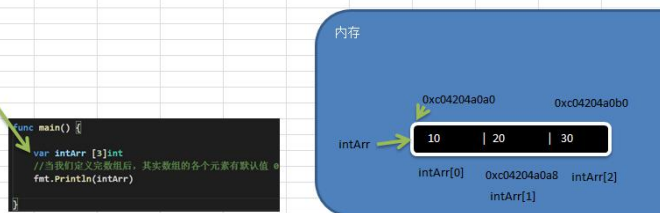

## 3.数组

### 3.1数组的定义

~~~go
var 数组名 [数组大小]数据类型
var a [5]int
~~~

### 3.2数组在内存布局

**总结：**

1. 数组的地址可以通过数组名来获取 &intArr
2. 数组的第一个元素的地址，就是数组的首地址
3. 数组的各个元素的地址间隔是依据数组的类型决定，比如int->64 int32->4...

~~~go
package main

import "fmt"

func main() {
	var intArr [3]int //int占8个字节
	//当我们定义完数组后，其实数组的各个元素有默认值0
	fmt.Println(intArr)
	intArr[0] = 10
	intArr[1] = 20
	intArr[2] = 30
	fmt.Printf("intArr的地址=%p intArr[0] 地址%p intArr[1] 地址%p intArr[2] 地址%p",
		&intArr, &intArr[0], &intArr[1], &intArr[2])
}
~~~

### 3.3初始化数组的方式

~~~go
package main

import "fmt"

func main() {
	//1
	var numArr01 [3]int = [3]int{1, 2, 3}
	fmt.Println(numArr01)
	//2
	var numArr02 = [3]int{4, 5, 6}
	fmt.Println(numArr02)
	//3
	var numArr03 = [...]int{7, 8, 9}
	fmt.Println(numArr03)
	//4
	var numArr04 = [...]int{1: 800, 0: 900, 2: 999}
	fmt.Println(numArr04)
}
~~~

### 3.4数组注意事项

1. 数组是多个相同类型数据的组合，一个数组一旦声明/定义了，其长度是固定的，不能动态变化

2. var arr []int 这时arr就是一个slice切片

3. 数组中的元素可以是任何数据类型，包括值类型和引用类型，但是不能混用。

4. 数组创建后，如果没有赋值，有默认值（零值）

   数值类型数组：默认值为0
   字符串数组：默认值为"
   bool数组：默认值为false

5. 使用数组的步骤1.声明数组并开辟空间2给数组各个元素赋值（默认零值）3使用数组

6. 数组的下标是从0开始的

7. 数组下标必须在指定范围内使用，否则报panic:数组越界，比如var arr [5]int则有效下标为0-4

8. Go的数组属值类型，在默认情况下是值传递，因此会进行值拷贝。数组间不会相互影响

9. 如想在其它函数中，去修改原来的数组，可以使用引用传递（指针方式）

   ~~~go
   package main
   
   import "fmt"
   
   func f(arr *[3]int) {
   	(*arr)[0] = 100
   }
   
   func main() {
   
   	var numArr = [3]int{1, 2, 3}
   	f(&numArr)
   	fmt.Println(numArr)
   }
   ~~~

10. 长度是数组类型的一部分，在传递函数参数时，需要考虑数组的长度

    