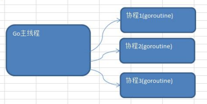
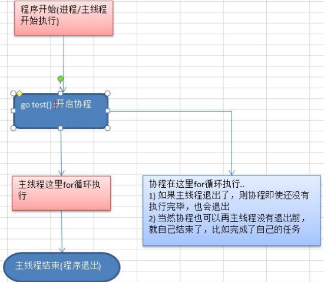
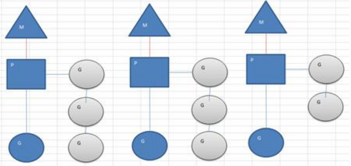
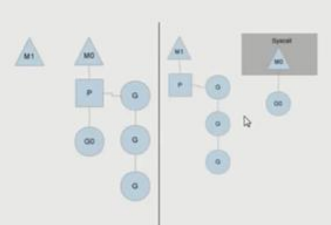
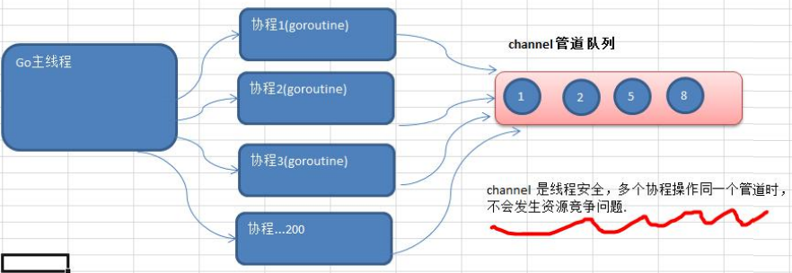

## 9. goroutine和channel

### 9.1 Go携程和Go主线程

Go主线程(有程序员直接称为线程/也可以理解成进程):一个Go线程上，可以起多个协程，你可以这样理解，协程是轻量级的线程[编译器做优化]。

Go协程的特点

1. 有独立的栈空间
2. 共享程序堆空间
3. 调度由用户控制
4. 协程是轻量级的线程




### 9.2 goroutine-快速入门

编写一个程序，完成如下功能

- 在主线程(可以理解成进程)中，开启一个goroutine，该协程每隔1秒输出"hello,world"
- 在主线程中也每隔一秒输出"hello,golang"，输出10次后，退出程序
- 要求主线程和goroutine同时执行
- 画出主线程和协程执行流程图

~~~go
package main

import (
	"fmt"
	"strconv"
	"time"
)

func test() {
	for i := 0; i < 10; i++ {
		fmt.Println("test hello world " + strconv.Itoa(i))
		time.Sleep(time.Second)
	}
}

func main() {
	go test() //开启一个协程
	for i := 0; i < 10; i++ {
		fmt.Println("main hello world " + strconv.Itoa(i))
		time.Sleep(time.Second)
	}
}
~~~



> 1. 主线程是一个物理线程，直接作用在cpu上的。是重量级的，非常耗费cpu资源。
> 2. 协程从主线程开启的，是轻量级的线程，是逻辑态。对资源消耗相对小。
> 3. Golang的协程机制是重要的特点，可以轻松的开启上万个协程。其它编程语言的并发机制是一般基于线程的，开启过多的线程，资源耗费大，这里就突显Golang在并发上的优势了

### 9.3 goroutine的调度模型

1. MPG模式基本介绍

   

   - M：操作系统的主线程（是物理线程）
   - P：协程执行需要的上下文
   - G：协程

2. MPG 模式运行的状态1

   

   - 当前程序有三个M，如果三个M都在一个cpu运行，就是并发，如果在不同的cpu运行就是并行
   - M1,M2,M3正在执行一个G，M1的协程队列有三个，M2的协程队列有3个，M3协程队列有2个
   - 从上图可以看到:Go的协程是轻量级的线程，是逻辑态的，Go可以容易的起上万个协程
   - 其它程序c/java的多线程，往往是内核态的，比较重量级，几千个线程可能耗光cpu

3. MPG 模式运行的状态2

   

   - 分成两个部分来看
   - 原来的情况是M0主线程正在执行Go协程,另外有三个协程在队列等待
   - 如果Go协程阻塞，比如读取文件或者数据库等
   - 这时就会创建M1主线程(也可能是从已有的线程池中取出M1)，并且将等待的3个协程挂到M1下开始执行，MO的主线程下的GO仍然执行文件io的读写
   - 这样的MPG调度模式,可以既让GO执行，同时也不会让队列的其它协程一直阻塞,仍然可以并发/并行执行
   - 等到GO不阻塞了，M0会被放到空闲的主线程继续执行(从已有的线程池中取)，同时GO又会被唤醒。

### 9.4设置Golang运行的cpu数

为了充分了利用多cpu的优势，在Golang程序中，设置运行的cpu数目

```go
package main

import (
   "fmt"
   "runtime"
)

func main() {
   //获取当前系统cpu数量
   num := runtime.NumCPU()
   //设置num-1的cpu运行go程序
   runtime.GOMAXPROCS(num)
   fmt.Println("num=", num)
}
```

1. go1.8后,默认让程序运行在多个核上,可以不用设置了
2. go1.8前，还是要设置一下，可以更高效的利益cpu

### 9.5 channel管道

需求:现在要计算 1-200 的各个数的阶乘，并且把各个数的阶乘放入到map中。最后显示出来。要求使用goroutine完成

分析思路：

- 使用goroutine来完成，效率高，但是会出现并发/并行安全问题
- 这里就提出了不同goroutine 如何通信的问题

### 9.6全局变量加锁

~~~go
package main

import (
	"fmt"
	"sync"
	"time"
)

var (
	myMap = make(map[int]int, 10)
    //定义
	lock  sync.Mutex
)

//test函数就是计算n!，将这个结果放入到myMap
func test(n int) {
	res := 1
	for i := 1; i <= n; i++ {
		res *= i
	}
    //加锁
	lock.Lock()
	myMap[n] = res
	//解锁
    lock.Unlock()
}
func main() {
	for i := 1; i <= 20; i++ {
		go test(i)
	}
	time.Sleep(time.Second * 5)
	lock.Lock()
	for key, value := range myMap {
		fmt.Printf("map[%d]=%d\n", key, value)
	}
	lock.Unlock()
}
~~~

### 9.7为什么需要channel

1. 前面使用全局变量加锁同步来解决goroutine 的通讯，但不完美
2. 主线程在等待所有goroutine全部完成的时间很难确定，我们这里设置5秒，仅仅是估算
3. 如果主线程休眠时间长了，会加长等待时间，如果等待时间短了，可能还有goroutine处于工作状态，这时也会随主线程的退出而销毁
4. 通过全局变量加锁同步来实现通讯，也并不利用多个协程对全局变量的读写操作
5. 上面种种分析都在呼唤一个新的通讯机制-channel

### 9.8 channel的基本介绍

1. channle 本质就是一个数据结构-队列
2. 数据是先进先出【FIFO : first in first out】
3. 线程安全，多goroutine访问时，不需要加锁，就是说channel本身就是线程安全的



### 9.9定义/申明channel

- channel是引用类型
- channel必须初始化才能写入数据，即make后才能使用
- 管道是有类型的，intChan只能写入整数int

~~~go
var intChan chan int//存放int数据
var mapChan chan map[int]string//存放map[int]string类型
~~~

### 9.10管道初始化、写入数据、读取数据注意事项

~~~go
package main

import "fmt"

func main() {
	//创建一个可以存放3个int类型的管道
	var intChan chan int
	intChan = make(chan int, 3)

	//看看intChan是什么
	fmt.Printf("intChan 的值=%v\nintChan本身的地址=%p\n", intChan, &intChan)

	//向管道写入数据
	intChan <- 10
	num := 211
	intChan <- num
	intChan <- 50

	//看看管道的长度和cap(容量)
	fmt.Printf("channel len=%v cap=%v\n", len(intChan), cap(intChan))

	//从管道中读数据
	var num2 int
	num2 = <-intChan
	fmt.Println("num2=", num2)
	fmt.Printf("channel len=%v cap=%v\n", len(intChan), cap(intChan))

	//在没有使用协程的情况下，如果我们的管道数据已经全部取出，再取会报告 deadlock
	num3 := <-intChan
	num4 := <-intChan
	//num5 := <-intChan
	fmt.Println(num3, num4)

}
~~~

1. channel中只能存放指定的数据类型
2. channel的数据放满后，就不能再放入了
3. 如果从channel取出数据后，可以继续放入
4. 在没有使用协程的情况下，如果channel数据取完了，再取，就会报dead lock

### 9.11 channel的关闭

使用内置函数close可以关闭channel，当channel关闭后，就不能再向channel写数据了，但是仍然可以从该channel读取数据

~~~go
package main

import "fmt"

func main() {
	intChan := make(chan int, 3)
	intChan <- 100
	intChan <- 200
	//关闭
	close(intChan)
	//关闭后可以继续读数据
	num := <-intChan
	fmt.Println(num)
}
~~~

### 9.12 channel的遍历

channel支持for--range的方式进行遍历，请注意两个细节

1. 在遍历时，如果channel没有关闭，则回出现deadlock的错误
2. 在遍历时，如果channel已经关闭，则会正常遍历数据，遍历完后，就会退出遍历

~~~go
package main

import "fmt"

func main() {
	intChan := make(chan int, 100)
	for i := 0; i < 100; i++ {
		intChan <- i
	}
	close(intChan)
	for v := range intChan {
		fmt.Println("v =", v)
	}
}
~~~

### 9.13应用实例

1. 应用1

   > 请完成goroutine和channel协同工作的案例，具体要求:
   > 1)开启一个writeData协程,向管道intChan中写入50个整数.
   >
   > 2)开启一个readData协程，从管道intChan中读取writeData写入的数据。
   >
   > 3)注意: writeData和readDate操作的是同一个管道
   >
   > 4)主线程需要等待writeData和readDate协程都完成工作才能退出【管道】
   >
   > 

   ~~~go
   package main
   
   import "fmt"
   
   func writeDate(intChan chan int) {
   	for i := 0; i < 50; i++ {
   		intChan <- i
   		fmt.Println("写入数据", i)
   	}
   	close(intChan)
   }
   
   func readData(intChan chan int, exitChan chan bool) {
   	for {
   		v, ok := <-intChan
   		if !ok { //如果intChan信道关闭
   			break
   		}
   		fmt.Println("读到数据", v)
   	}
   	exitChan <- true
   	close(exitChan)
   }
   
   func main() {
   	//创建两个管道
   	intChan := make(chan int, 50)
   	exitChan := make(chan bool, 1)
   
   	go writeDate(intChan)
   	go readData(intChan, exitChan)
   
   	for {
   		_, ok := <-exitChan
   		if !ok {
   			break
   		}
   	}
   }
   ~~~

2. 应用2

   > 要求统计1-200000的数字中，哪些是素数?
   >
   > 传统的方法，就是使用一个循环，循环的判断各个数是不是素数。
   > 使用并发/并行的方式，将统计素数的任务分配给多个(4个)goroutine去完成，完成任务时间短。
   >
   > 

   ~~~go
   package main
   
   import (
   	"fmt"
   	"math"
   )
   
   func putNum(intChan chan int) {
   	for i := 1; i <= 8000; i++ {
   		intChan <- i
   	}
   	close(intChan)
   }
   func isPrime(num int) bool {
   	if num < 2 {
   		return false
   	}
   	flag := true
   	for i := 2; i <= int(math.Sqrt(float64(num))); i++ {
   		if num%i == 0 {
   			flag = false
   			break
   		}
   	}
   	return flag
   }
   func primeNum(intChan chan int, primeChan chan int, exitChan chan bool) {
   	for {
   		v, ok := <-intChan
   		if !ok {
   			break
   		}
   		if isPrime(v) {
   			primeChan <- v
   		}
   	}
   	exitChan <- true
   }
   
   func main() {
   	//创建两个管道
   	intChan := make(chan int, 1000)
   	primeChan := make(chan int, 2000)
   	exitChan := make(chan bool, 4)
   
   	//开启一个协程，向intChan中放入1-8000
   	go putNum(intChan)
   
   	//开启四个协程，从intChan中取出数据并判断是否是素数
   	for i := 0; i < 4; i++ {
   		go primeNum(intChan, primeChan, exitChan)
   	}
   
   	go func() {
   		for i := 0; i < 4; i++ {
   			<-exitChan
   		}
   		//当我们从exitChan中取出了4个结果，就可以关闭primeChan
   		close(primeChan)
   	}()
   	
   	for {
   		res, ok := <-primeChan
   		if !ok {
   			break
   		}
   		fmt.Println(res)
   	}
   
   }
   ~~~

### 9.14 channel使用细节和注意事项

1. channel 可以声明为只读，或者只写性质

   ~~~go
   package main
   
   import "fmt"
   
   func main() {
   
   	//声明为只写
   	var chan1 chan<- int
   	chan1 = make(chan int, 3)
   	chan1 <- 20
   	fmt.Println(chan1)
   
   	//声明为只读
   	var chan2 <-chan int
   	fmt.Println(chan2)
   }
   ~~~

2. 使用select可以解决从管道取数据的阻塞问题

   ~~~go
   package main
   
   import "fmt"
   
   func main() {
   
   	intChan := make(chan int, 10)
   	for i := 0; i < 10; i++ {
   		intChan <- i
   	}
   	stringChan := make(chan string, 5)
   	for i := 0; i < 5; i++ {
   		stringChan <- "hello" + fmt.Sprintf("%d", i)
   	}
   
   	for {
   		select {
   		case v := <-intChan:
   			fmt.Println(v)
   		case v := <-stringChan:
   			fmt.Println(v)
   		default:
   			fmt.Println("都取不到了")
   			return
   		}
   	}
   }
   ~~~

3. goroutine中使用recover，解决协程中出现panic，导致程序崩溃问题

   ~~~go
   package main
   
   import (
   	"fmt"
   	"time"
   )
   
   func sayHello() {
   	for i := 0; i < 10; i++ {
   		time.Sleep(time.Second)
   		fmt.Println("hello")
   	}
   }
   
   func test() {
   	defer func() {
   		//捕获抛出的异常
   		if err := recover(); err != nil {
   			fmt.Println("发生错误：", err)
   		}
   	}()
   	var myMap map[int]string
   	myMap[0] = "feedsheep"
   }
   
   func main() {
   
   	go sayHello()
   	go test()
   
   	for i := 0; i < 10; i++ {
   		fmt.Println("main ok")
   		time.Sleep(time.Second)
   	}
   
   }
   ~~~

   
