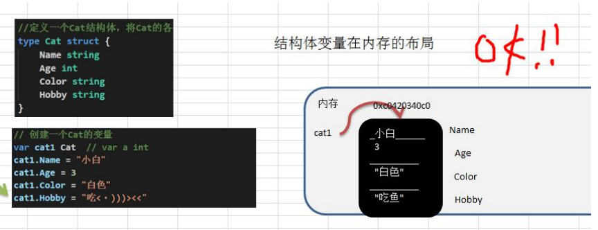
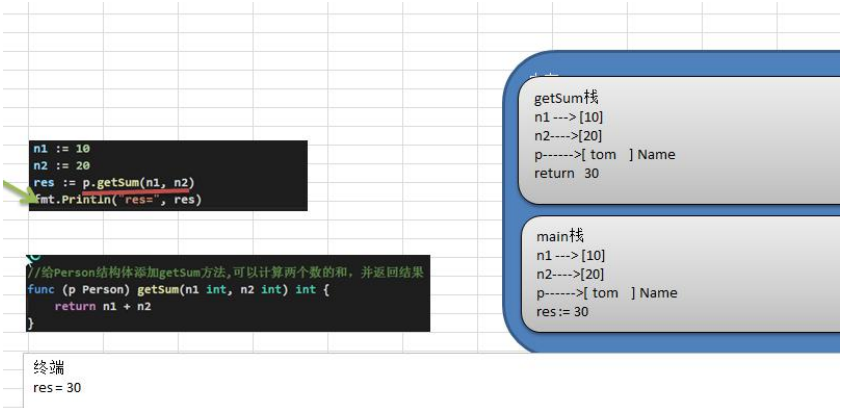

## 6.面向对象编程

### 6.1 Golang语音面向对象编程说明

1. Golang也支持面向对象编程(OOP)，但是和传统的面向对象编程有区别，并不是纯粹的面向对象语言。所以我们说Golang支持面向对象编程特性是比较准确的。
2. Golang没有类(class)，Go语言的结构体(struct)和其它编程语言的类(class)有同等的地位，你可以理解Golang 是基于struct 来实现OOP特性的。
3. Golang面向对象编程非常简洁，去掉了传统OOP语言的继承、方法重载、构造函数和析构函数、隐藏的this 指针等等
4. Golang仍然有面向对象编程的继承，封装和多态的特性，只是实现的方式和其它OOP语言不一样，比如继承:Golang没有extends关键字，继承是通过匿名字段来实现。
5. Golang面向对象(OOP)很优雅，OOP本身就是语言类型系统(type system)的一部分，通过接口(interface)关联，耦合性低，也非常灵活。后面同学们会充分体会到这个特点。也就是说在Golang 中面向接口编程是非常重要的特性。

### 6.2结构体变量在内存的布局

### 6.3如何申明结构体

~~~go
type 结构体名称 struct {
field1 type
field2 type
}

//例子
type Student struct {
	Name string
	Age int
	Score float64
}
~~~

### 6.4创建结构体变量和访问结构体字段

1. 方法1-直接声明

   ~~~go
   var person Person
   ~~~

2. 方法2-{}

   ~~~go
   person := Person{"feedSheep", 22, 100}
   ~~~

3. 方法3-&

   ~~~go
   package main
   
   import "fmt"
   
   type Person struct {
   	Name  string
   	Age   int
   	Score float64
   }
   
   func main() {
   	var person *Person = new(Person)
       //标准的写法
   	(*person).Name = "wyy"
       //这样也可以
   	person.Name = "feedSheep"
   	fmt.Println(*person)
   }
   ~~~

   原因:go的设计者为了程序员使用方便，底层会对person.Name = "feedSheep"进行处理，会给person加上取值运算(*person).Name = "feedSheep"

4. 方法4-{}

   ~~~go
   package main
   
   import "fmt"
   
   type Person struct {
   	Name  string
   	Age   int
   	Score float64
   }
   
   func main() {
   	var person = &Person{}
   	(*person).Name = "wyy"
   	person.Name = "feedSheep"
   	fmt.Println(*person)
   }
   ~~~

5. 结构体使用注意事项和细节

   - 结构体的所有字段在内存中是连续的

   - 结构体是用户单独定义的类型，和其它类型进行转换时需要有完全相同的字段(名字、个数和类型)

     ~~~go
     package main
     
     import "fmt"
     
     type A struct {
     	Num int
     }
     
     type B struct {
     	Num int
     }
     
     func main() {
     	var a A
     	var b B
     	//B类型转换为A类型
     	a = A(b)
     	fmt.Println(a, b)
     }
     ~~~

   - 结构体进行type重新定义(相当于取别名)，Golang认为是新的数据类型，但是相互间可以强转

     ~~~go
     package main
     
     import "fmt"
     
     type A struct {
     	Num int
     }
     
     //取别名
     type B A
     
     func main() {
     	var a A
     	var b B
     	a = A(b)
     	fmt.Println(a, b)
     }
     ~~~

   - struct 的每个字段上，可以写上一个tag，该tag可以通过反射机制获取，常见的使用场景就是序列化和反序列化。

     ~~~go
     package main
     
     import (
     	"encoding/json"
     	"fmt"
     )
     
     type Monster struct {
     	Name  string `json:"name"`
     	Age   int    `json:"age"`
     	Skill string `json:"skill"`
     }
     
     func main() {
     
     	monster := Monster{
     		Name:  "牛魔王",
     		Age:   500,
     		Skill: "芭蕉扇",
     	}
     
     	jsonStr, err := json.Marshal(monster)
     	if err != nil {
     		fmt.Println("json处理错误", err)
     	}
     	fmt.Printf("%s", jsonStr)//{"name":"牛魔王","age":500,"skill":"芭蕉扇"}
     }
     ~~~

### 6.5方法的声明和调用

Golang中的方法是作用在指定的数据类型上的(即:和指定的数据类型绑定)，因此自定义类型，都可以有方法，而不仅仅是struct。

~~~go
package main

import "fmt"

type Person struct {
	Name string
}

func (p Person) test() {
	fmt.Println(p.Name)
}

func main() {
	var person Person
	person.Name = "feedSheep"
	person.test()
}
~~~

1. test方法和Person类型绑定
2. test方法只能通过Person类型的变量来调用，而不能直接调用，也不能使用其它类型变量来调用
3. func(p Person) test() {}...p表示哪个Person变量调用,这个p就是它的副本，这点和函数传参非常相似。

### 6.6方法的调用和传参机制原理

方法的调用和传参机制和函数基本一样，不一样的地方是方法调用时，会将调用方法的变量，当做实参也传递给方法。

**说明：**

1. 在通过一个变量去调用方法时，其调用机制和函数一样
2. 不一样的地方时，变量调用方法时，该变量本身也会作为一个参数传递到方法(如果变量是值类型，则进行值拷贝，如果变量是引用类型，则进行地址拷贝)

### 6.7方法的注意事项和细节

1. 结构体类型是值类型，在方法调用中，遵守值类型的传递机制，是值拷贝传递方式

2. 如程序员希望在方法中，修改结构体变量的值，可以通过结构体指针的方式来处理

   ~~~go
   package main
   
   import "fmt"
   
   type Person struct {
   	Name string
   }
   
   func (p *Person) test() {
   	p.Name = p.Name + "666"
   }
   
   func main() {
   	var person Person
   	person.Name = "feedSheep"
   	person.test()
   	fmt.Println(person.Name)
   }
   ~~~

3. Golang 中的方法作用在指定的数据类型上的(即:和指定的数据类型绑定)，因此自定义类型，都可以有方法，而不仅仅是struct，比如 int , float32等都可以有方法

   ~~~go
   package main
   
   import "fmt"
   
   type integer int
   
   func (i *integer) add() {
   	*i = *i + 1
   }
   
   func main() {
   	var num integer
   	num.add()
   	fmt.Println(num)
   }
   ~~~

4. 方法的访问范围控制的规则，和函数一样。方法名首字母小写，只能在本包访问，方法首字母大写，可以在本包和其它包访问。

5. 如果一个类型实现了String()这个方法，那么fimt.PrintIn默认会调用这个变量的String()进行输出

   ~~~go
   package main
   
   import "fmt"
   
   type Person struct {
   	Name string
   }
   
   func (p *Person) String() string {
   	return "我叫" + p.Name
   }
   
   func main() {
   	var person Person
   	person.Name = "feedSheep"
   	fmt.Println(&person)//我叫feedSheep
   }
   ~~~

### 6.8工厂模式

Golang的结构体没有构造函数，通常可以使用工厂模式来解决这个问题。

student.go

~~~go
package model

type student struct {
	Name string
	age  int
}

func NewStudent(n string, age int) *student {
	return &student{
		Name: n,
		age:  age,
	}
}
~~~

main.go

~~~go
package main

import (
	"fmt"
	"go_code/project01/factory/model"
)

func main() {
	student := model.NewStudent("feedSheep", 22)
	fmt.Println(*student)
}
~~~

### 6.9抽象

我们在前面去定义一个结构体时候，实际上就是把一类事物的共有的属性(字段)和行为(方法)提取出来，形成一个物理模型(结构体)。这种研究问题的方法称为抽象。

~~~go
package main

import "fmt"

//定义一个结构体 Account
type Account struct {
	AccountNo string
	Pwd       string
	Balance   float64
}

// Deposit 存款
func (account *Account) Deposit(money float64, pwd string) {
	if pwd != account.Pwd {
		fmt.Println("密码错误")
		return
	}
	if money < 0 {
		fmt.Println("输入金额错误")
		return
	}

	account.Balance += money
	fmt.Println("存款成功")
}

// WithDraw 取款
func (account *Account) WithDraw(money float64, pwd string) {
	if pwd != account.Pwd {
		fmt.Println("密码错误")
		return
	}
	if money < 0 || money > account.Balance {
		fmt.Println("输入金额错误")
		return
	}

	account.Balance -= money
	fmt.Println("取款成功")
}

// Query 查询余额
func (account Account) Query(pwd string) {
	if pwd != account.Pwd {
		fmt.Println("密码错误")
		return
	}
	fmt.Printf("你的账号为%v，余额为%v\n", account.AccountNo, account.Balance)
}

func main() {
	account := Account{
		AccountNo: "1234569",
		Pwd:       "123456",
		Balance:   100.6,
	}
	account.Query("123456")
	account.Deposit(200, "123456")
	account.WithDraw(100, "123456")
	account.Query("123456")
}
~~~

### 6.10继承

在Golang 中，如果一个struct 嵌套了另一个匿名结构体，那么这个结构体可以直接访问匿名结构体的字段和方法，从而实现了继承特性。

~~~go
type Goods struct {
	Name string
	Price int
}

type Book struct {
	Goods//这里就是嵌套匿名结构体Goods
	Writer string
}
~~~

1. 结构体可以使用嵌套匿名结构体所有的字段和方法，即:首字母大写或者小写的字段、方法，都可以使用。

   ~~~go
   package main
   
   import "fmt"
   
   type A struct {
   	Name string
   	age  int
   }
   
   func (a *A) SayOk() {
   	fmt.Println("A SayOk", a.Name)
   }
   
   func (a *A) hello() {
   	fmt.Println("A hello", a.Name)
   }
   
   type B struct {
   	A
   }
   
   func main() {
   	var b B
   	b.A.Name = "tom"
   	b.A.age = 19
   	b.A.SayOk()
   	b.A.hello()
   }
   ~~~
   
2. 匿名结构体字段访问可以简化

   ~~~go
   package main
   
   import "fmt"
   
   type A struct {
   	Name string
   	age  int
   }
   
   func (a *A) SayOk() {
   	fmt.Println("A SayOk", a.Name)
   }
   
   func (a *A) hello() {
   	fmt.Println("A hello", a.Name)
   }
   
   type B struct {
   	A
   }
   
   func main() {
   	var b B
   	//简化
   	b.Name = "tom"
   	b.age = 19
   	b.SayOk()
   	b.hello()
   }
   ~~~

3. 当结构体和匿名结构体有相同的字段或者方法时，编译器采用就近访问原则访问，如希望访问匿名结构体的字段和方法，可以通过匿名结构体名来区分

4. 结构体嵌入两个(或多个)匿名结构体，如两个匿名结构体有相同的字段和方法(同时结构体本身没有同名的字段和方法)，在访问时，就必须明确指定匿名结构体名字，否则编译报错。

5. 如果一个struct嵌套了一个有名结构体，这种模式就是组合，如果是组合关系，那么在访问组合的结构体的字段或方法时，必须带上结构体的名字

6. 嵌套匿名结构体后，也可以在创建结构体变量(实例)时，直接指定各个匿名结构体字段的值

### 6.11多重继承

如一个struct 嵌套了多个匿名结构体，那么该结构体可以直接访问嵌套的匿名结构体的字段和方法，从而实现了多重继承。

### 6.12接口

interface类型可以定义一组方法，但是这些不需要实现。并且interface不能包含任何变量。到某个自定义类型要使用的时候,在根据具体情况把这些方法写出来(实现)。

~~~go
package main

import "fmt"

type Usb interface {
	//申明两个没有实现的方法
	Start()
	Stop()
}

type Phone struct {
}

func (phone Phone) Start() {
	fmt.Println("phone start")
}

func (phone Phone) Stop() {
	fmt.Println("phone stop")
}

type Camera struct {
}

func (camera Camera) Start() {
	fmt.Println("camera start")
}

func (camera Camera) Stop() {
	fmt.Println("camera stop")
}

type Computer struct {
}

func (computer Computer) Working(usb Usb) {
	usb.Start()
	usb.Stop()
}
func main() {
	computer := Computer{}
	phone := Phone{}
	camera := Camera{}
	computer.Working(phone)
	computer.Working(camera)
}
~~~

1. 接口里的所有方法都没有方法体，即接口的方法都是没有实现的方法。接口体现了程序设计的多态和高内聚低偶合的思想。
2. Golang 中的接口，不需要显式的实现。只要一个变量，含有接口类型中的所有方法，那么这个变量就实现这个接口。因此，Golang 中没有implement这样的关键字

### 6.13接口注意事项和细节

1. 接口本身不能创建实例,但是可以指向一个实现了该接口的自定义类型的变量(实例)

   ~~~go
   package main
   
   import "fmt"
   
   type AInterface interface {
   	Say()
   }
   
   type Student struct {
   }
   
   func (s Student) Say() {
   	fmt.Println("student say")
   }
   
   func main() {
   	var a AInterface = Student{}
   	a.Say()
   }
   ~~~

2. 接口中所有的方法都没有方法体,即都是没有实现的方法

3. 在Golang 中，一个自定义类型需要将某个接口的所有方法都实现，我们说这个自定义类型实现了该接口

4. 一个自定义类型只有实现了某个接口，才能将该自定义类型的实例(变量)赋给接口类型

5. 只要是自定义数据类型，就可以实现接口，不仅仅是结构体类型

   ~~~go
   package main
   
   import "fmt"
   
   type integer int
   
   type aInterface interface {
   	Say()
   }
   
   func (i integer) Say() {
   	fmt.Println("say")
   }
   
   func main() {
   	var i integer = 10
   	var a aInterface = i
   	a.Say()
   }
   ~~~

6. 一个自定义类型可以实现多个接口

7. Golang接口中不能有任何变量

8. 一个接口(比如A接口)可以继承多个别的接口(比如B,C接口)，这时如果要实现A接口，也必须将B,C接口的方法也全部实现

9. interface类型默认是一个指针(引用类型)，如果没有对interface初始化就使用，那么会输出nil

10. 空接口interface没有任何方法,所以所有类型都实现了空接口，即我们可以把任何一个变量赋给空接口

### 6.14接口编程实践

实现对Hero 结构体切片的排序: sort.Sort(data Interface)

~~~go
package main

import (
	"fmt"
	"math/rand"
	"sort"
)

//声明Hero结构体
type Hero struct {
	Name string
	Age  int
}

//声明一个Hero结构体切片类型
type HeroSlice []Hero

func (hs HeroSlice) Len() int {
	return len(hs)
}

//Less方法就是决定你使用什么标准进行排序
//按Hero的年龄从小到大排序！！
func (hs HeroSlice) Less(i, j int) bool {
	return hs[i].Age < hs[j].Age
}

func (hs HeroSlice) Swap(i, j int) {
	hs[i], hs[j] = hs[j], hs[i]
}
func main() {
	var heroes HeroSlice
	for i := 0; i < 10; i++ {
		hero := Hero{
			Name: fmt.Sprintf("英雄|%d", rand.Intn(100)),
			Age:  rand.Intn(100),
		}
		//讲hero append到heroes切片
		heroes = append(heroes, hero)
	}
	//输出排序前
	fmt.Println("排序前：")
	for _, hero := range heroes {
		fmt.Println(hero)
	}
	//排序
	sort.Sort(heroes)
	fmt.Println("排序后")
	for _, hero := range heroes {
		fmt.Println(hero)
	}
}
~~~

### 6.15多态

变量(实例)具有多种形态。面向对象的第三大特征，在Go语言，多态特征是通过接口实现的。可以按照统一的接口来调用不同的实现。这时接口变量就呈现不同的形态。

### 6.16类型断言

类型断言，由于接口是一般类型，不知道具体类型，如果要转成具体类型，就需要使用类型断言

~~~go
package main

import "fmt"

func main() {
	var x interface{}
	var b float32 = 1.1
	x = b
	y := x.(float32)//类型断言
	fmt.Printf("类型为%T  值为%v", y, y)
}
~~~

在进行类型断言时，如果类型不匹配，就会报 panic，因此进行类型断言时，要确保原来的空接口指向的就是断言的类型

> **在 进行断言时，带上检测机制，如果成功就ok，否则也不要报panic**
>
> ~~~go
> package main
> 
> import "fmt"
> 
> func main() {
> 	var x interface{}
> 	var b float32 = 1.1
> 	x = b
> 	//类型断言(带检测的)
> 	if y, ok := x.(float32); ok {
> 		fmt.Println("convert success")
> 		fmt.Printf("y的类型为%T  值为%v\n", y, y)
> 	} else {
> 		fmt.Println("convert fail")
> 	}
> 	fmt.Println("继续执行")
> }
> ~~~

### 6.17类型断言实践

写一函数，循环判断传入参数的类型：

~~~go
package main

import "fmt"

type Student struct {
	name string
	age  int
}

func TypeJudge(items ...interface{}) {
	for i, item := range items {
		switch item.(type) {
		case bool:
			fmt.Printf("第%v个参数是bool类型，值是%v\n", i, item)
		case float32:
			fmt.Printf("第%v个参数是float32类型，值是%v\n", i, item)
		case float64:
			fmt.Printf("第%v个参数是float64类型，值是%v\n", i, item)
		case int, int32, int64:
			fmt.Printf("第%v个参数是整数类型，值是%v\n", i, item)
		case string:
			fmt.Printf("第%v个参数是string类型，值是%v\n", i, item)
		case Student:
			fmt.Printf("第%v个参数是Student类型，值是%v\n", i, item)
		default:
			fmt.Printf("第%v个参数是不确定类型，值是%v\n", i, item)
		}
	}
}

func main() {
	var n1 float32 = 1.1
	var n2 float64 = 2.3
	var n3 int32 = 30
	var name string = "tom"
	address := "北京"
	n4 := 300
	n5 := Student{
		name: "feedsheep",
		age:  22,
	}

	TypeJudge(n1, n2, n3, n4, name, address, n5)

}
~~~

