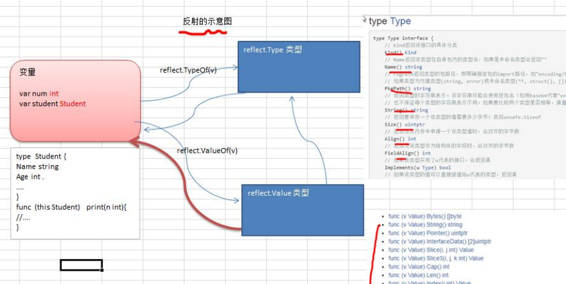
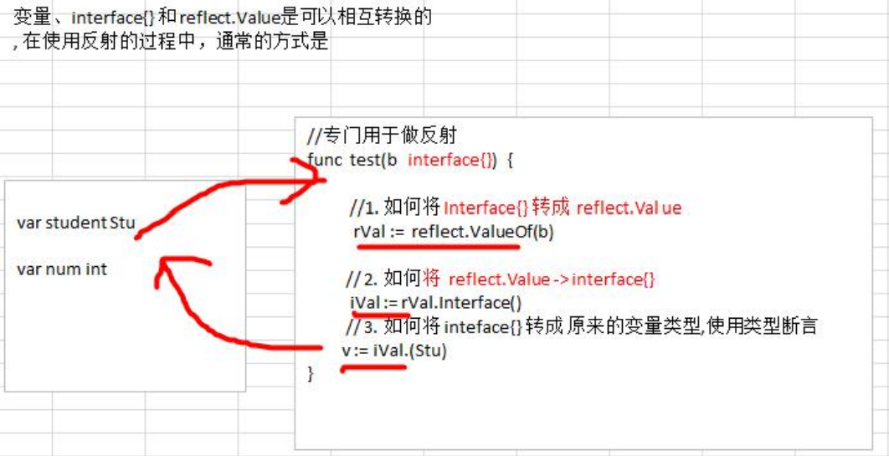
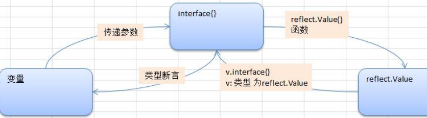

## 10.反射

### 10.1反射的基本介绍

1. 反射可以在运行时动态获取变量的各种信息，比如变量的类型(type)，类别(kind)
2. 如果是结构体变量，还可以获取到结构体本身的信息(包括结构体的字段、方法)
3. 通过反射，可以修改变量的值，可以调用关联的方法
4. 使用反射，需要import ( "reflect")
5. 

### 10.2反射的应用场景

1. 不知道接口调用哪个函数，根据传入参数在运行时确定调用的具体接口，这种需要对函数或方法反射。例如以下这种桥接模式

   ~~~go
   func bridge(funcPtr interface{}, args ...interface{})
   ~~~

   第一个参数funcPtr以接口的形式传入函数指针，函数参数args以可变参数的形式传入，bridge函数中可以用反射来动态执行funcPtr函数

2. 对结构体序列化时，如果结构体有指定Tag,也会使用到反射生成对应的字符串

### 10.3反射重要的函数和概念

1. reflect.TypeOf(变量名)，获取变量的类型，返回reflect.Type类型

2. reflect.ValueOf(变量名)，获取变量的值，返回reflect.Value类型reflect.Value是一个结构体类型。通过reflect.Value，可以获取到关于该变量的很多信息

3. 变量、interface和reflect. Value是可以相互转换的，这点在实际开发中，会经常使用到

   

   

### 10.4反射案例

1. 案例1

   ~~~go
   package main
   
   import (
   	"fmt"
   	"reflect"
   )
   
   func reflectTest01(b interface{}) {
   	//通过反射获取传入的变量的type、kind、值
   
   	//1.获取reflect.Type
   	rTyp := reflect.TypeOf(b)
   	fmt.Println("rTyp=", rTyp)
   
   	//2.获取reflect.Value
   	rVal := reflect.ValueOf(b)
   	fmt.Printf("rVal type=%T    rVal=%v\n", rVal, rVal)
   
   	//将rVal转成interface{}
   	iV := rVal.Interface()
   	//将interface{}通过断言转成需要的类型
   	num2 := iV.(int)
   	fmt.Println("num2=", num2)
   }
   
   func main() {
   	//演示（基本数据类型、interface{}、reflect.Value）进行反射的基本操作
   	var num int = 100
   	reflectTest01(num)
   }
   ~~~

2. 案例2

   ~~~go
   package main
   
   import (
   	"fmt"
   	"reflect"
   )
   
   type Student struct {
   	Name string
   	Age  int
   }
   
   func reflect02(b interface{}) {
   	//通过反射获取传入的变量的type、kind、值
   
   	//1.获取reflect.Type
   	rTyp := reflect.TypeOf(b)
   	fmt.Println("rTyp=", rTyp)
   
   	//2.获取reflect.Value
   	rVal := reflect.ValueOf(b)
   	fmt.Printf("rVal type=%T    rVal=%v\n", rVal, rVal)
   
   	//将rVal转成interface{}
   	iV := rVal.Interface()
   	fmt.Printf("iv=%v iv type=%T \n", iV, iV)
   	//将interface{}通过断言转成需要的类型
   	stu, ok := iV.(Student)
   	if ok {
   		fmt.Printf("stu.Name=%v\n", stu.Name)
   	}
   }
   
   func main() {
   	stu := Student{
   		Name: "feedsheep",
   		Age:  22,
   	}
   	reflect02(stu)
   }
   ~~~

### 10.5反射的注意事项和细节

1. reflect.Value.Kind，获取变量的类别，返回的是一个常量

2. Type和 Kind 的区别
   Type是类型,Kind是类别，Type和 Kind 可能是相同的，也可能是不同的

   比如: var num int = 10 num的Type是int , Kind也是int
   比如:  var stu Student stu的 Type是 pkg1.Student , Kind是struct

3. 通过反射的来修改变量，注意当使用SetXxx方法来设置需要通过对应的指针类型来完成，这样才能改变传入的变量的值，同时需要使用到reflect. Value.Elem()方法

   ~~~go
   package main
   
   import (
   	"fmt"
   	"reflect"
   )
   
   func testInt(b interface{}) {
   	val := reflect.ValueOf(b)
   	val.Elem().SetInt(110)
   	fmt.Println(val)
   }
   func main() {
   	var num int = 20
   	testInt(&num)
   	fmt.Println(num)
   }
   ~~~

### 10.6反射最佳实践

1. 使用反射来遍历结构体的字段，调用结构体的方法，并获取结构体标签的值

   ~~~go
   package main
   
   import (
   	"fmt"
   	"reflect"
   )
   
   type Monster struct {
   	Name  string  `json:"name"`
   	Age   int     `json:"monster_age"`
   	Score float32 `json:"成绩"`
   	Sex   string
   }
   
   func (monster Monster) GetSum(n1, n2 int) int {
   	return n1 + n2
   }
   
   func (monster *Monster) Set(name string, age int, score float32, sex string) {
   	monster.Name = name
   	monster.Age = age
   	monster.Score = score
   	monster.Sex = sex
   }
   
   func (monster Monster) Print() {
   	fmt.Println("-----start-----")
   	fmt.Println(monster)
   	fmt.Println("-----end-----")
   
   }
   
   func TestStruct(a interface{}) {
   	//获取reflect.Type类型
   	typ := reflect.TypeOf(a)
   	//获取reflect.Value类型
   	val := reflect.ValueOf(a)
   	//获取到a对应的类别
   	kd := val.Kind()
   	//如果传入的不是struct，就退出
   	if kd != reflect.Struct {
   		fmt.Println("不是结构体")
   		return
   	}
   
   	//获取到该结构体有几个字段
   	num := val.NumField()
   	fmt.Printf("结构体有%d个字段\n", num)
   
   	//变量结构体的所有字段
   	for i := 0; i < num; i++ {
   		fmt.Printf("第%v个字段的值为%v\n", i, val.Field(i))
   		//获取到struct标签，注意需要通过reflect.Type来获取tag标签的值
   		tagVal := typ.Field(i).Tag.Get("json")
   		//如果字段有tag有显示，否则不显示
   		if tagVal != "" {
   			fmt.Printf("第%v个字段的标签为%v\n", i, tagVal)
   		} else {
   			fmt.Printf("第%v个字段没有标签\n", i)
   		}
   	}
   
   	//获取到该结构体有多少个方法
   	numOfMethod := val.NumMethod()
   	fmt.Printf("结构体有%d个方法\n", numOfMethod)
   
   	//方法的排序默认按照函数名的排序(ASCII码)
   	val.Method(1).Call(nil) //获取到第二个方法，调用它
   
   	//调用结构体的第1个方法Method(0)
   	var params []reflect.Value
   	params = append(params, reflect.ValueOf(10))
   	params = append(params, reflect.ValueOf(40))
   	res := val.Method(0).Call(params) //传入的参数是[]reflect.Value，返回[]reflect.Value
   	fmt.Println("res=", res[0].Int()) //返回结果，返回的结果是[]reflect.Value
   }
   func main() {
   	monster := Monster{
   		Name:  "黄鼠狼精",
   		Age:   400,
   		Score: 30.8,
   		Sex:   "m",
   	}
   	TestStruct(monster)
   }
   ~~~

   

