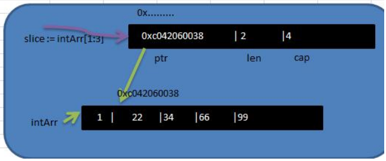
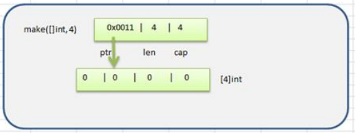
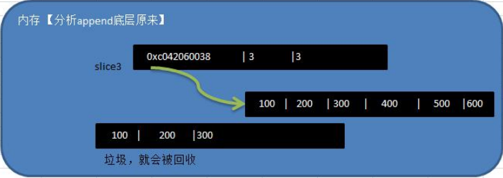
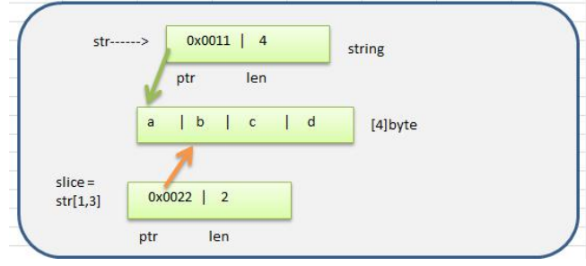

## 4.切片

### 4.1切片的基本介绍

1. 切片的英文是slice
2. 切片是数组的一个引用，因此切片是引用类型，在进行传递时，遵守引用传递的机制
3. 切片的使用和数组类似，遍历切片、访问切片的元素和求切片长度都一样
4. 切片的长度是可以变化的，切片是一个可以动态变化数组

### 4.2切片基本语法

~~~go
package main

import "fmt"

func main() {

	var intArr = [5]int{1, 22, 33, 66, 99}
	slice := intArr[1:3]
	fmt.Println("slice的元素是", slice)
	fmt.Println("slice的元素个数是", len(slice))
	fmt.Println("slice的容量是", cap(slice))
}
~~~

### 4.3切片在内存中形式

1. slice是一个引用类型

2. slice从底层来说，其实就是一个数据结构(struct结构体)

   ~~~go
   type slice struct {
   	ptr *[2]int
   	len int
   	cap int
   }
   ~~~

### 4.4切片的使用

1. **方式1**

   定义一个切片，让切片去引用一个已经创建好的数组。

   ~~~go
   package main
   
   import "fmt"
   
   func main() {
   
   	var intArr = [5]int{1, 22, 33, 66, 99}
   	slice := intArr[1:3]
   	fmt.Println("slice的元素是", slice)
   	fmt.Println("slice的元素个数是", len(slice))
   	fmt.Println("slice的容量是", cap(slice))
   }
   ~~~

2. **方式2**

   通过make来创建切片

   基本语法：**var 切片名 []type = make([]type,len,[cap])**

   参数说明： 

   **type**:就是数据类型;

   **len**:大小;

   **cap**：指定切片容量，可选，如果你分配了cap,则要求cap>=len

   ~~~go
   package main
   
   import "fmt"
   
   func main() {
   	slice := make([]float64, 5, 10)
   	slice[1] = 10
   	slice[3] = 10
   	fmt.Println("slice的元素是", slice)
   	fmt.Println("slice的元素个数是", len(slice))
   	fmt.Println("slice的容量是", cap(slice))
   }
   ~~~

3. **方式3**

   定义一个切片，直接就指定具体数组，使用原理类似make方式

   ~~~go
   package main
   
   import "fmt"
   
   func main() {
   	var slice []string = []string{"tom", "jack", "mary"}
   	fmt.Println("slice的元素是", slice)
   	fmt.Println("slice的元素个数是", len(slice))
   	fmt.Println("slice的容量是", cap(slice))
   }
   ~~~

>**方式1和方式2的区别（面试）**
>
>- 方式1是直接引用数组，这个数组是事先存在的，程序员是可见的
>- 方式2是通过make来创建切片，make也会创建一个数组，是由切片在底层进行维护
>
>

### 4.5切片使用的注意事项和细节讨论

1. 切片初始化时 **var slice = arr[startIndex:endIndex]**

   说明：从arr数组下标为startIndex,取到下标为endIndex的元素（不含arr[endIndex])

2. 切片初始化时，仍然不能越界。范围在[0-len(arr)]之间，但是可以动态增长.

   - var slice=arr[0:end]可以简写 var slice=arr[:end]
   - var slice=arr[start:len(arr)]可以简写 var slice=arr[start:]
   - var slice=arr[0:len(arr)]可以简写 var slice=arr[:]

3. cap是一个内置函数，用于统计切片的容量，即最大可以存放多少个元素

4. 切片定义完后，还不能使用，因为本身是一个空的，需要让其引用到一个数组，或者make一个空间供切片来使用

5. 切片可以继续切片

   ~~~go
   package main
   
   import "fmt"
   
   func main() {
   
   	var intArr = [5]int{10, 20, 30, 40, 50}
   	slice := intArr[1:4] //[20,30,40]
   	slice2 := slice[1:2] //[30]
   	slice2[0] = 100
   	fmt.Println("slice的元素是", slice)   //slice的元素是 [20 100 40]
   	fmt.Println("slice2的元素是", slice2) //slice2的元素是 [100]
   }
   ~~~

### 4.6切片动态追加/删除

用append内置函数，可以对切片进行动态追加

~~~go
package main

import "fmt"

func main() {

	slice := []int{100, 200, 300}
	//通过append直接给slice追加具体元素
	slice = append(slice, 400, 500, 600)
	fmt.Println(slice) //[100 200 300 400 500 600]

	//通过append将切片slice追加给slice
	slice = append(slice, slice...)
	fmt.Println(slice)//[100 200 300 400 500 600 100 200 300 400 500 600]
}
~~~

切片中删除一个元素删除

~~~go
package main

import "fmt"

func main() {

	var nums []int
	nums = append(nums, 1, 2, 3, 4, 5)
	index := 3
	//删除下标index的元素
	nums = append(nums[:index], nums[index+1:]...)
	fmt.Println(nums)

~~~

> **切片append底层原理分析**
>
> - 切片append操作的本质就是对数组扩容
> - go底层会创建一下新的数组newArr(安装扩容后大小)
> - 将slice原来包含的元素拷贝到新的数组newArr
> - slice重新引用到newArr
> - 注意newArr是在底层来维护的，程序员不可见.
>
> 

### 4.7切片的拷贝

切片使用copy内置函数完成拷贝

~~~go
package main

import "fmt"

func main() {

	slice := []int{1, 2, 3, 4, 5}
	slice2 := make([]int, 10)
	copy(slice2, slice)
	fmt.Println(slice)
	fmt.Println(slice2)
}
~~~

slice和slice2的数据空间是独立，相互不影响，也就是说slice[0]=999，slice2[0]仍然是1

### 4.8 string和slice

1. string底层是一个byte数组，因此string也可以进行切片处理

   ~~~go
   package main
   
   import "fmt"
   
   func main() {
   
   	str := "FeedSheep"
   	slice := str[5:]
   	fmt.Println(slice)//heep
   }
   ~~~

2. string和切片在内存的形式

   

3. string是不可变的，也就说不能通过str[O]='z'方式来修改字符串。如果需要修改字符串，可以先将string>byte/或者rune->修改->重写转成string

   ~~~go
   package main
   
   import "fmt"
   
   func main() {
   	//字符串修改方式
   	str := "FeedSheep"
   	arr1 := []byte(str)
   	arr1[0] = 'f'
   	str = string(arr1)
   	fmt.Println(str) //feedSheep
   
   	//若存在中文，则使用[]rune
   	arr2 := []rune(str)
   	arr2[0] = '北'
   	str = string(arr2)
   	fmt.Println(str) //北eedSheep
   }
   ~~~

   
