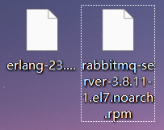
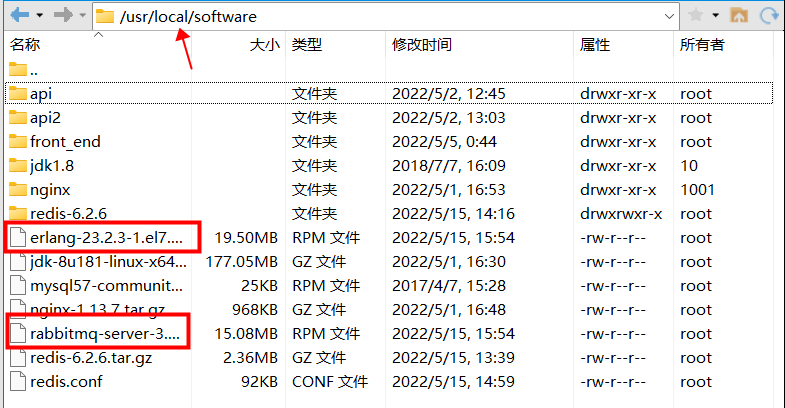
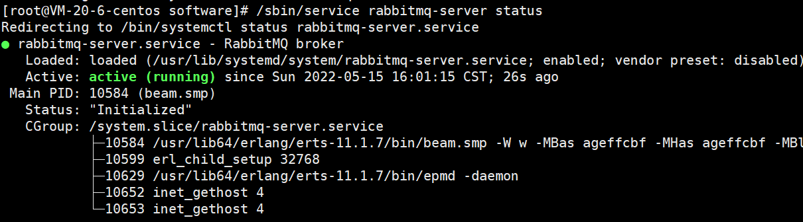
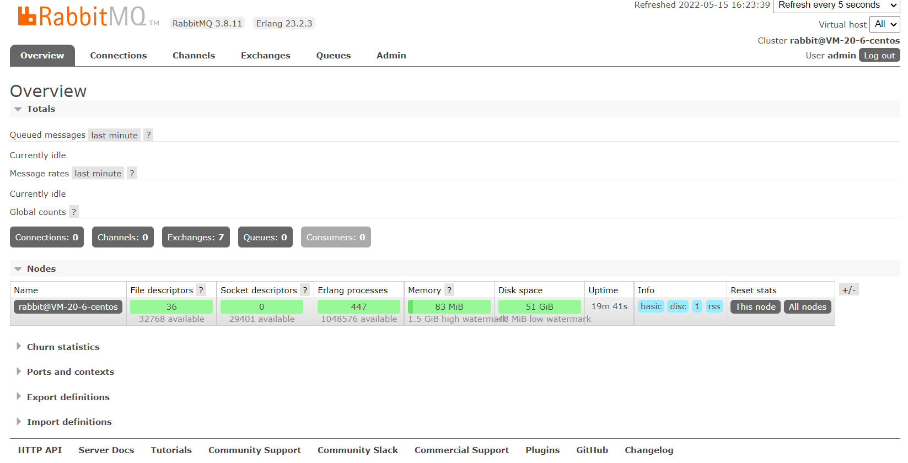

## 1.官网下载

### 1.1下载地址

Erlang官网地址：https://www.erlang.org/

RabbitMQ官网地址： https://www.rabbitmq.com/download.html

### 1.2自行选择版本下载

具体下什么版本要去网上搜搜，需要保证两个文件版本互相能用

## 2.开始安装

### 2.1文件上传

将刚刚下载好的文件上传到/usr/local/software 目录下

### 2.2安装文件

1. ~~~
   rpm -ivh erlang-23.2.3-1.el7.x86_64.rpm
   ~~~

2. ~~~
   yum install socat -y
   ~~~

3. ~~~
   rpm -ivh rabbitmq-server-3.8.11-1.el7.noarch.rpm
   ~~~

### 2.3验证安装

1. 添加开机启动 RabbitMQ 服务

   ~~~
   chkconfig rabbitmq-server on
   ~~~

2. 启动服务

   ~~~
   /sbin/service rabbitmq-server start
   ~~~

3. 查看服务状态

   ~~~
   /sbin/service rabbitmq-server status
   ~~~

   

4. 停止服务

   ~~~
   /sbin/service rabbitmq-server stop
   ~~~

5. 开启 web 管理插件

   ~~~
   rabbitmq-plugins enable rabbitmq_management
   ~~~

   

## 3.添加一个拥有所有权限的用户

### 3.1创建账号

~~~
rabbitmqctl add_user admin 123
~~~

### 3.2设置用户角色

~~~
rabbitmqctl set_user_tags admin administrator
~~~

### 3.3设置用户权限

~~~
rabbitmqctl set_permissions -p "/" admin ".*" ".*" ".*"
~~~

### 3.4查看当前用户和角色

~~~
rabbitmqctl list_users
~~~

### 3.5用创建好的用户登录web管理页面

## 4.安装延时队列插件

### 4.1下载地址

https://www.rabbitmq.com/community-plugins.html

### 4.2安装

1. 解压放置到 RabbitMQ 的插件目录(/usr/lib/rabbitmq/lib/rabbitmq_server-3.8.11/plugins)

2. 进入 RabbitMQ 的安装目录下的 plgins 目录，执行下面命令让该插件生效

   ~~~
   rabbitmq-plugins enable rabbitmq_delayed_message_exchange
   ~~~

3. 重启RabbitMQ

   ~~~
   systemctl restart rabbitmq-server.service
   ~~~

   
