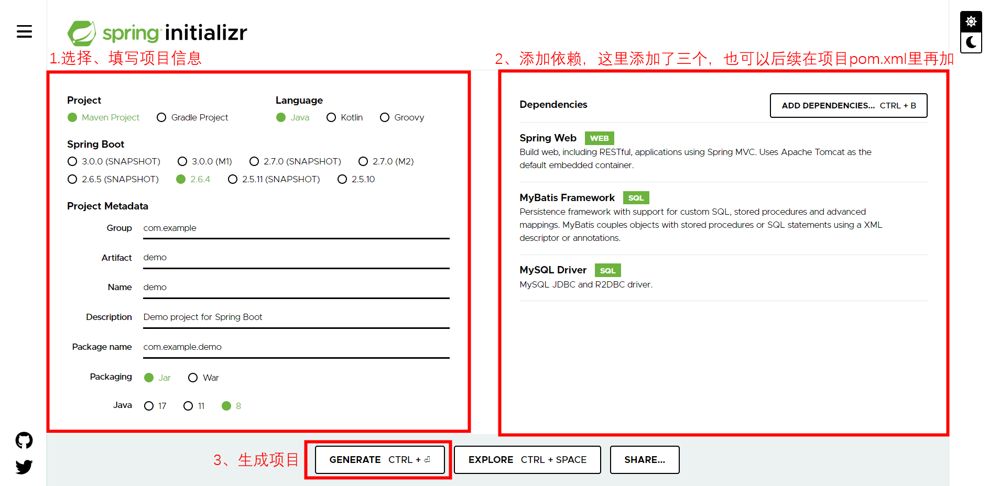
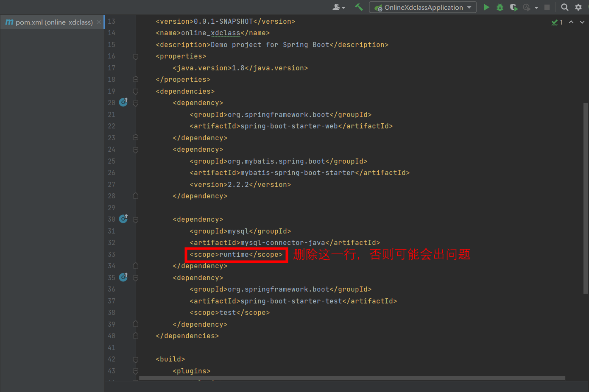
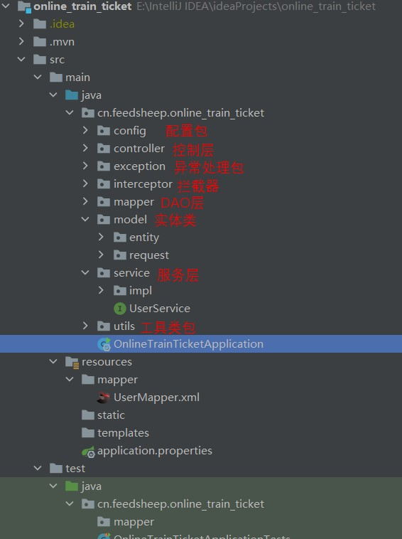
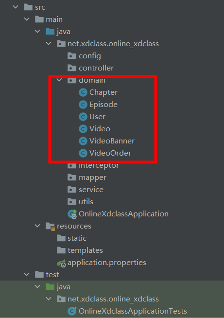

## 打开Spring官网在线创建地址

1. 打开地址：https://start.spring.io/
2. 
3. 会下载一个压缩包，解压到项目的位置，并用IDEA打开


## 配置依赖

1. 第一次操作会下载很多jar包，耐心等待几分钟。如果下载失败或下载过慢，请检查mevan是否安装、是否更换镜像。

2. 打开pom.xml

   - 如果刚刚创建时选择了依赖，文件内已经存在相关依赖，但是需要删掉一行。

     

   - 如果创建时没有选择依赖，则需要手动加入依赖

   - 列举了几个依赖，可以自行添加（也可以去https://mvnrepository.com/search?q=spring自己查）

     - springboot核心包

       ~~~xml
       <dependency>
       	<groupId>org.springframework.boot</groupId>
       	<artifactId>spring-boot-starter-web</artifactId>
       </dependency>
       <dependency>
       	<groupId>org.springframework.boot</groupId>
       	<artifactId>spring-boot-starter-test</artifactId>
       	<scope>test</scope>
       	<exclusions>
       		<exclusion>
       			<groupId>org.junit.vintage</groupId>
       			<artifactId>junit-vintage-engine</artifactId>
       		</exclusion>
       	</exclusions>
       </dependency>
       ~~~

     - mybaits依赖

       ~~~xml
       <dependency>
             <groupId>org.mybatis.spring.boot</groupId>
             <artifactId>mybatis-spring-boot-starter</artifactId>
             <version>2.1.2</version>
       </dependency>
       ~~~

     - mysql驱动 (注意需要去掉runtime，否则报错)

       ~~~xml
       <dependency>
             <groupId>mysql</groupId>
             <artifactId>mysql-connector-java</artifactId>
       </dependency>
       ~~~

     - 通用工具包

       ~~~xml
       <dependency>
             <groupId>org.apache.commons</groupId>
             <artifactId>commons-lang3</artifactId>
             <version>3.9</version>
       </dependency>
       ~~~

     - 跨域身份验证解决方案 Json web token包

       ~~~xml
       <!-- JWT相关 -->
       <dependency>
             <groupId>io.jsonwebtoken</groupId>
             <artifactId>jjwt</artifactId>
             <version>0.7.0</version>
       </dependency>
       ~~~

     - 高性能缓存组件

       ~~~xml
       <!--guava依赖包-->
       <dependency>
             <groupId>com.google.guava</groupId>
             <artifactId>guava</artifactId>
             <version>19.0</version>
       </dependency>
       ~~~

     - Lombok
       
        ```xml
        <dependency>
        	<groupId>org.projectlombok</groupId>
        	<artifactId>lombok</artifactId>
        </dependency>
        ```
        
     - mybatis-plus
     
        ~~~xml
        <dependency>
        	<groupId>com.baomidou</groupId>
        	<artifactId>mybatis-plus-boot-starter</artifactId>
        	<version>3.5.1</version>
        </dependency>
        ~~~
     
     - 发送邮件
     
        ~~~xml
        <!-- 发送邮件 -->
        <dependency>
        	<groupId>org.springframework.boot</groupId>
        	<artifactId>spring-boot-starter-mail</artifactId>
        </dependency>
        <dependency>
        	<groupId>org.springframework</groupId>
        	<artifactId>spring-context-support</artifactId>
        </dependency>
        
        <!--用于实现模板邮件-->
        <dependency>
        	<groupId>org.springframework.boot</groupId>
        	<artifactId>spring-boot-starter-thymeleaf</artifactId>
        </dependency>
        ~~~
     
     - redis
     
        ~~~xml
        <!--springBoot集成redis-->
        <dependency>
        	<groupId>org.springframework.boot</groupId>
        	<artifactId>spring-boot-starter-data-redis</artifactId>
        	<version>2.5.4</version>
        </dependency>
        ~~~
     
     - rabbitmq
     
        ~~~xml
        <!--RabbitMQ 依赖-->
        <dependency>
        	<groupId>org.springframework.boot</groupId>
        	<artifactId>spring-boot-starter-amqp</artifactId>
        </dependency>
        ~~~
     
     - 重试依赖
     
        ~~~xml
        <!--重试依赖-->
        <dependency>
        	<groupId>org.springframework.retry</groupId>
        	<artifactId>spring-retry</artifactId>
        </dependency>
        <dependency>
        	<groupId>org.aspectj</groupId>
        	<artifactId>aspectjweaver</artifactId>
        	<version>1.9.5</version>
        </dependency>
        <dependency>
        	<groupId>org.aspectj</groupId>
        	<artifactId>aspectjrt</artifactId>
        	<version>1.9.5</version>
        </dependency>
        ~~~
     
        

## 项目结构

1. 添加包

   

2. 添加实体类

   

