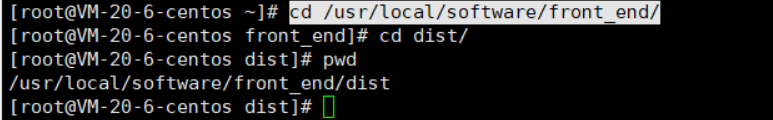
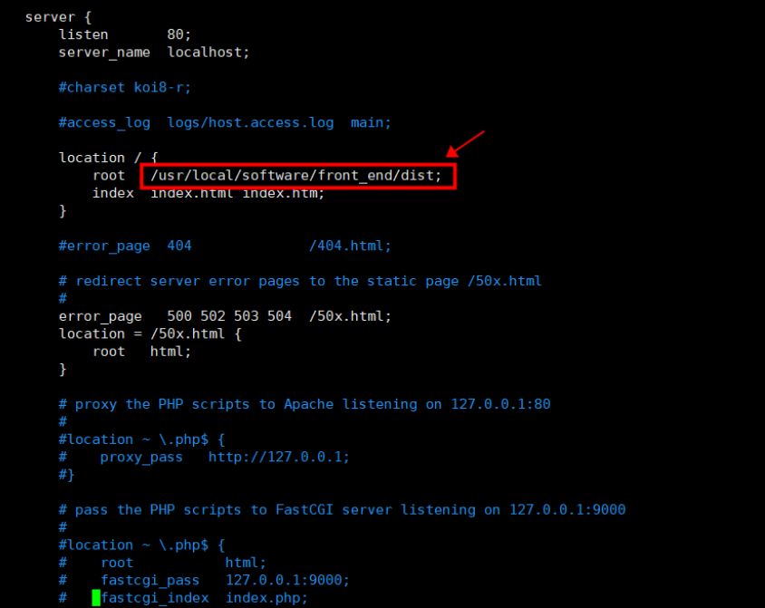

## 打包项目

### -后端项目打包

~~~
mvn clean install package '-Dmaven.test.skip=true'
~~~

### -前端项目打包

~~~
cnpm run build
~~~

## 部署项目

### -后端

1. 将jar包放入/usr/local/software/api内
2. 在api文件夹内添加application.properties

3. 启动jar包

   ~~~
   nohup java -jar -Despring.config.location=./application.properties online_xdclass-0.0.1-SNAPSHOT.jar &
   ~~~

4. 测试接口

   ~~~
   curl 127.0.0.1:8081/api/v1/pub/video/list_banner
   ~~~

### -前端

1. 将dist文件夹放入/usr/local/software/front_end内

2. 进入

   ~~~
   cd /usr/local/nginx/
   ~~~

3. ~~~
   cd conf/
   ~~~

4. 配置nginx

   ~~~
   vim nginx.conf
   ~~~

   找到dist全路径名

   

   ~~~
   cd /usr/local/software/front_end/dist/
   pwd
   ~~~

   

   保存退出

5. 重启nginx服务

   ~~~
   cd ../sbin/
   ./nginx -s reload
   ~~~

