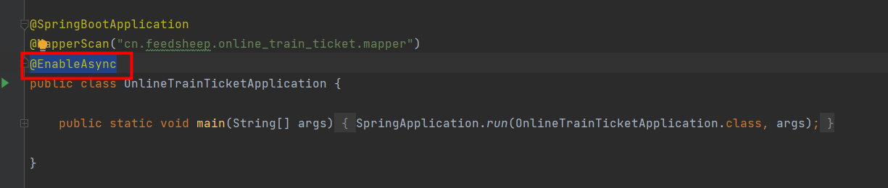

**本文用于整理自己曾用过的工具类**

## 1.MD5加密

~~~java
public class MDFiveUtils {

    /**
     * MD5加密工具类
     * @param data
     * @return
     */
    public static String toMD5(String data)  {
        try {
            java.security.MessageDigest md = MessageDigest.getInstance("MD5");
            byte[] array = md.digest(data.getBytes("UTF-8"));
            StringBuilder sb = new StringBuilder();
            for (byte item : array) {
                sb.append(Integer.toHexString((item & 0xFF) | 0x100).substring(1, 3));
            }

            return sb.toString().toUpperCase();
        } catch (Exception exception) {
        }
        return null;

    }

}
~~~

## 2.响应json数据给前端

~~~java
public class JsonMessageUtils {

    /**
     * 响应json数据给前端
     * @param response
     * @param obj
     */
    public static void sendJsonMessage(HttpServletResponse response, Object obj){

        try {

            ObjectMapper objectMapper = new ObjectMapper();
            response.setContentType("application/json; charset=utf-8");
            PrintWriter writer = response.getWriter();
            writer.print(objectMapper.writeValueAsString(obj));
            writer.close();
            response.flushBuffer();

        }catch (Exception e){
            e.printStackTrace();
        }

    }

}
~~~

## 3.手机号、邮箱、身份证正则表达式格式判断

~~~java
public class MatcherUtils {
    /**
     * 校验身份证号
     * @param IDNumber
     * @return
     */
    public static boolean isIDNumber(String IDNumber) {
        if (IDNumber == null || "".equals(IDNumber)) {
            return false;
        }
        // 定义判别用户身份证号的正则表达式（15位或者18位，最后一位可以为字母）
        String regularExpression = "(^[1-9]\\d{5}(18|19|20)\\d{2}((0[1-9])|(10|11|12))(([0-2][1-9])|10|20|30|31)\\d{3}[0-9Xx]$)|" +
                "(^[1-9]\\d{5}\\d{2}((0[1-9])|(10|11|12))(([0-2][1-9])|10|20|30|31)\\d{3}$)";
        //假设18位身份证号码:41000119910101123X  410001 19910101 123X
        //^开头
        //[1-9] 第一位1-9中的一个      4
        //\\d{5} 五位数字           10001（前六位省市县地区）
        //(18|19|20)                19（现阶段可能取值范围18xx-20xx年）
        //\\d{2}                    91（年份）
        //((0[1-9])|(10|11|12))     01（月份）
        //(([0-2][1-9])|10|20|30|31)01（日期）
        //\\d{3} 三位数字            123（第十七位奇数代表男，偶数代表女）
        //[0-9Xx] 0123456789Xx其中的一个 X（第十八位为校验值）
        //$结尾

        //假设15位身份证号码:410001910101123  410001 910101 123
        //^开头
        //[1-9] 第一位1-9中的一个      4
        //\\d{5} 五位数字           10001（前六位省市县地区）
        //\\d{2}                    91（年份）
        //((0[1-9])|(10|11|12))     01（月份）
        //(([0-2][1-9])|10|20|30|31)01（日期）
        //\\d{3} 三位数字            123（第十五位奇数代表男，偶数代表女），15位身份证不含X
        //$结尾

        boolean matches = IDNumber.matches(regularExpression);

        //判断第18位校验值
        if (matches) {

            if (IDNumber.length() == 18) {
                try {
                    char[] charArray = IDNumber.toCharArray();
                    //前十七位加权因子
                    int[] idCardWi = {7, 9, 10, 5, 8, 4, 2, 1, 6, 3, 7, 9, 10, 5, 8, 4, 2};
                    //这是除以11后，可能产生的11位余数对应的验证码
                    String[] idCardY = {"1", "0", "X", "9", "8", "7", "6", "5", "4", "3", "2"};
                    int sum = 0;
                    for (int i = 0; i < idCardWi.length; i++) {
                        int current = Integer.parseInt(String.valueOf(charArray[i]));
                        int count = current * idCardWi[i];
                        sum += count;
                    }
                    char idCardLast = charArray[17];
                    int idCardMod = sum % 11;
                    if (idCardY[idCardMod].toUpperCase().equals(String.valueOf(idCardLast).toUpperCase())) {
                        return true;
                    } else {
                        return false;
                    }

                } catch (Exception e) {
                    e.printStackTrace();
                    return false;
                }
            }

        }
        return matches;
    }

    /**
     * 校验手机号码
     * @param phoneNumber
     * @return
     */
    public static boolean isPhoneNumber(String phoneNumber){
        Pattern phonePattern = Pattern.compile("^1(3\\d{2}|4[14-9]\\d|5([0-35689]\\d|7[1-79])|66\\d|7[2-35-8]\\d|8\\d{2}|9[13589]\\d)\\d{7}$");
        Matcher phoneMatcher = phonePattern.matcher(phoneNumber);
        return phoneMatcher.matches();
    }

    public static boolean isEmail(String email){
        /**
         *   正则表达式实用规则
         *   ^匹配输入字符串的开始位置
         *   $结束的位置
         *   \转义字符 eg:\. 匹配一个. 字符  不是任意字符 ，转义之后让他失去原有的功能
         *   \t制表符
         *   \n换行符
         *   \\w匹配字符串  eg:\w不能匹配 因为转义了
         *   \w匹配包括字母数字下划线的任何单词字符
         *   \s包括空格制表符换行符
         *   *匹配前面的子表达式任意次
         *   .小数点可以匹配任意字符
         *   +表达式至少出现一次
         *   ?表达式0次或者1次
         *   {10}重复10次
         *   {1,3}至少1-3次
         *   {0,5}最多5次
         *   {0,}至少0次 不出现或者出现任意次都可以 可以用*号代替
         *   {1,}至少1次  一般用+来代替
         *   []自定义集合     eg:[abcd]  abcd集合里任意字符
         *   [^abc]取非 除abc以外的任意字符
         *   |  将两个匹配条件进行逻辑“或”（Or）运算
         *   [1-9] 1到9 省略123456789
         *    邮箱匹配 eg: ^[a-zA-Z_]{1,}[0-9]{0,}@(([a-zA-z0-9]-*){1,}\.){1,3}[a-zA-z\-]{1,}$
         *
         */
        String RULE_EMAIL = "^\\w+((-\\w+)|(\\.\\w+))*\\@[A-Za-z0-9]+((\\.|-)[A-Za-z0-9]+)*\\.[A-Za-z0-9]+$";
        //正则表达式的模式 编译正则表达式
        Pattern p = Pattern.compile(RULE_EMAIL);
        //正则表达式的匹配器
        Matcher m = p.matcher(email);
        //进行正则匹配
        return m.matches();
    }
}

~~~

## 4.返回给前端的数据进行封装

~~~java
public class JsonData {
    /**
     * 状态码 0表示成功,1表示处理中,-1表示失败
     */
    private Integer code;

    /**
     * 业务数据
     */
    private Object data;

    /**
     * 信息描述
     */
    private String msg;

    public JsonData(){}

    public JsonData(Integer code,Object data,String msg){

        this.code = code;

        this.data = data;

        this.msg = msg;
    }

    /**
     * 成功，不用返回数据
     * @return
     */
    public static JsonData buildSuccess(){
        return new JsonData(0,null,null);
    }

    /**
     * 成功，返回数据
     * @param data
     * @return
     */
    public static JsonData buildSuccess(Object data){
        return new JsonData(0,data,null);
    }

    /**
     * 失败，返回固定状态码和错误信息
     * @param msg
     * @return
     */
    public static JsonData buildError(String msg){
        return new JsonData(-1,null,msg);
    }

    /**
     * 失败，返回自定义状态码和错误信息
     * @param code
     * @param msg
     * @return
     */
    public static JsonData buildError(Integer code,String msg){
        return new JsonData(code,null,msg);
    }

    public Integer getCode() {
        return code;
    }

    public void setCode(Integer code) {
        this.code = code;
    }

    public Object getData() {
        return data;
    }

    public void setData(Object data) {
        this.data = data;
    }

    public String getMsg() {
        return msg;
    }

    public void setMsg(String msg) {
        this.msg = msg;
    }
}
~~~

## 5.JWT工具类

~~~java
/**
 * 注意点：
 * 1、生成的token，是可以通过base64进行解密出明文信息
 * 2、base64进行解密出明文信息，修改再进行编码，则会解密失败
 * 3、无法作废已颁布的token，除非改密钥
 */
public class JWTUtils {

    /**
     * 过期时间 一周
     */
    private static final long EXPIRE = 60000 * 60 * 24 * 7;//过期时间 一周

    /**
     * 加密密钥
     */
    private static final String SECRET = "feedsheep.cn";

    /**
     * 令牌前缀
     */
    private static final String TOKEN_PREFIX = "train.ticket";

    /**
     * subject
     */
    private static final String SUBJECT = "feedsheep";

    /**
     * 根据用户信息生成令牌
     * @param user
     * @return
     */
    public static String geneJsonWebToken(User user){

        String token = Jwts.builder().setSubject(SUBJECT)
                .claim("id",user.getId())//向负载添加数据
                .claim("name",user.getUserName())//向负载添加数据
                .setIssuedAt(new Date())//设置创建时间
                .setExpiration(new Date(System.currentTimeMillis() + EXPIRE))//设置过期时间
                .signWith(SignatureAlgorithm.HS256,SECRET)//设置加密方法和密钥
                .compact();

        token = TOKEN_PREFIX + token;

        return token;
    }

    /**
     * 校验token的方法
     * @param token
     * @return
     */
    public static Claims checkJWT(String token){

        try {

            final Claims claims = Jwts.parser().setSigningKey(SECRET).parseClaimsJws(token.replace(TOKEN_PREFIX,"")).getBody();

            return claims;

        }catch (Exception e){
            return null;
        }

    }

}
~~~

## 6.redis工具类

**引入依赖**

~~~xml
        <!--springBoot集成redis-->
        <dependency>
            <groupId>org.springframework.boot</groupId>
            <artifactId>spring-boot-starter-data-redis</artifactId>
            <version>2.5.4</version>
        </dependency>

        <dependency>
            <groupId>com.alibaba</groupId>
            <artifactId>fastjson</artifactId>
            <version>1.2.75</version>
        </dependency>
~~~

**配置**

~~~properties
#==============================Redis相关配置========================================
spring.redis.host=192.168.44.128
#Redis服务器连接端口
spring.redis.port=6379
#Redis服务器连接密码（默认为空）
spring.redis.password=
#连接池最大连接数（使用负值表示没有限制）
spring.redis.pool.max-active=8
#连接池最大阻塞等待时间（使用负值表示没有限制）
spring.redis.pool.max-wait=-1
#连接池中的最大空闲连接
spring.redis.pool.max-idle=8
#连接池中的最小空闲连接
spring.redis.pool.min-idle=0
#连接超时时间（毫秒）
spring.redis.timeout=30000
~~~

**工具类**

~~~java
import com.alibaba.fastjson.JSON;
import com.alibaba.fastjson.JSONArray;
import com.alibaba.fastjson.JSONObject;
import lombok.extern.slf4j.Slf4j;
import org.springframework.beans.factory.annotation.Autowired;
import org.springframework.data.redis.core.StringRedisTemplate;
import org.springframework.stereotype.Component;
import org.springframework.util.StringUtils;

import java.util.Collection;
import java.util.Collections;
import java.util.Date;
import java.util.List;
import java.util.concurrent.TimeUnit;

@Slf4j
@Component
public class CacheService {
    @Autowired
    private StringRedisTemplate redisTemplate;

    private final String DEFAULT_KEY_PREFIX = "";
    private final int EXPIRE_TIME = 1;
    private final TimeUnit EXPIRE_TIME_TYPE = TimeUnit.DAYS;

    /**
     * 数据用Json格式缓存至redis
     *
     * @param key
     * @param value
     * @return
     */
    public <K, V> void addInJson(K key, V value) {
        try {
            if (value != null) {
                redisTemplate
                        .opsForValue()
                        .set(DEFAULT_KEY_PREFIX + key, JSON.toJSONString(value));
            }
        } catch (Exception e) {
            log.error(e.getMessage(), e);
            throw new RuntimeException("数据缓存至redis失败");
        }
    }

    /**
     * 数据用Json格式缓存至redis并设置过期时间
     *
     * @param key
     * @param value
     * @return
     */
    public <K, V> void addInJson(K key, V value, long timeout, TimeUnit unit) {
        try {
            if (value != null) {

                redisTemplate
                        .opsForValue()
                        .set(DEFAULT_KEY_PREFIX + key, JSON.toJSONString(value), timeout, unit);
            }
        } catch (Exception e) {
            log.error(e.getMessage(), e);
            throw new RuntimeException("数据缓存至redis失败");
        }
    }

    /**
     * 将数据存入缓存并设置过期时间
     * @param key
     * @param value
     */
    public void add(String key, String value) {
        try {
            if (value != null) {

                redisTemplate
                        .opsForValue()
                        .set(DEFAULT_KEY_PREFIX + key, value);
            }
        } catch (Exception e) {
            log.error(e.getMessage(), e);
            throw new RuntimeException("数据缓存至redis失败");
        }
    }

    /**
     * 将数据存入缓存不设置过期时间
     * @param key
     * @param value
     * @param timeout
     * @param unit
     */
    public void add(String key, String value, long timeout, TimeUnit unit) {
        try {
            if (value != null) {

                redisTemplate
                        .opsForValue()
                        .set(DEFAULT_KEY_PREFIX + key, value, timeout, unit);
            }
        } catch (Exception e) {
            log.error(e.getMessage(), e);
            throw new RuntimeException("数据缓存至redis失败");
        }
    }

    /**
     * 写入 hash-set,已经是key-value的键值，不能再写入为hash-set
     *
     * @param key    must not be {@literal null}.
     * @param subKey must not be {@literal null}.
     * @param value  写入的值
     */
    public <K, SK, V> void addHashCache(K key, SK subKey, V value) {
        redisTemplate.opsForHash().put(DEFAULT_KEY_PREFIX + key, subKey, value);
    }

    /**
     * 写入 hash-set,并设置过期时间
     *
     * @param key    must not be {@literal null}.
     * @param subKey must not be {@literal null}.
     * @param value  写入的值
     */
    public <K, SK, V> void addHashCache(K key, SK subKey, V value, long timeout, TimeUnit unit) {
        redisTemplate.opsForHash().put(DEFAULT_KEY_PREFIX + key, subKey, value);
        redisTemplate.expire(DEFAULT_KEY_PREFIX + key, timeout, unit);
    }

    /**
     * 获取 hash-setvalue
     *
     * @param key    must not be {@literal null}.
     * @param subKey must not be {@literal null}.
     */
    public <K, SK> Object getHashCache(K key, SK subKey) {
        return  redisTemplate.opsForHash().get(DEFAULT_KEY_PREFIX + key, subKey);
    }

    /**
     * 从redis中获取缓存数据，转成对象
     *
     * @param key   must not be {@literal null}.
     * @param clazz 对象类型
     * @return
     */
    public <K, V> V getObject(K key, Class<V> clazz) {
        String value = this.get(key);
        V result = null;
        if (!StringUtils.isEmpty(value)) {
            result = JSONObject.parseObject(value, clazz);
        }
        return result;
    }

    /**
     * 从redis中获取缓存数据，转成list
     *
     * @param key   must not be {@literal null}.
     * @param clazz 对象类型
     * @return
     */
    public <K, V> List<V> getList(K key, Class<V> clazz) {
        String value = this.get(key);
        List<V> result = Collections.emptyList();
        if (!StringUtils.isEmpty(value)) {
            result = JSONArray.parseArray(value, clazz);
        }
        return result;
    }

    /**
     * 功能描述：Get the value of {@code key}.
     *
     * @param key must not be {@literal null}.
     **/
    public <K> String get(K key) {
        String value;
        try {
            value = redisTemplate.opsForValue().get(DEFAULT_KEY_PREFIX + key);
        } catch (Exception e) {
            log.error(e.getMessage(), e);
            throw new RuntimeException("从redis缓存中获取缓存数据失败");
        }
        return value;
    }

    /**
     * 删除key
     */
    public void delete(String key) {
        redisTemplate.delete(key);
    }

    /**
     * 批量删除key
     */
    public void delete(Collection<String> keys) {
        redisTemplate.delete(keys);
    }

    /**
     * 序列化key
     */
    public byte[] dump(String key) {
        return redisTemplate.dump(key);
    }

    /**
     * 是否存在key
     */
    public Boolean hasKey(String key) {
        return redisTemplate.hasKey(key);
    }

    /**
     * 设置过期时间
     */
    public Boolean expire(String key, long timeout, TimeUnit unit) {
        return redisTemplate.expire(key, timeout, unit);
    }

    /**
     * 设置过期时间
     */
    public Boolean expireAt(String key, Date date) {
        return redisTemplate.expireAt(key, date);
    }

    /**
     * 移除 key 的过期时间，key 将持久保持
     */
    public Boolean persist(String key) {
        return redisTemplate.persist(key);
    }

    /**
     * 返回 key 的剩余的过期时间
     */
    public Long getExpire(String key, TimeUnit unit) {
        return redisTemplate.getExpire(key, unit);
    }

    /**
     * 返回 key 的剩余的过期时间
     */
    public Long getExpire(String key) {
        return redisTemplate.getExpire(key);
    }
}
~~~

## 7.发邮件工具类

**引入依赖**

~~~xml
        <!-- 发送邮件 -->
        <dependency>
            <groupId>org.springframework.boot</groupId>
            <artifactId>spring-boot-starter-mail</artifactId>
        </dependency>
        <dependency>
            <groupId>org.springframework</groupId>
            <artifactId>spring-context-support</artifactId>
        </dependency>

        <!--用于实现模板邮件-->
        <dependency>
            <groupId>org.springframework.boot</groupId>
            <artifactId>spring-boot-starter-thymeleaf</artifactId>
        </dependency>
~~~

**配置**

~~~~properties
#==============================发邮件相关配置========================================
#邮箱服务商的protocol服务器主机
spring.mail.host=smtp.qq.com
spring.mail.port=25
#邮件协议
spring.mail.protocol=smtp
#指定邮箱服务商的邮箱账号
spring.mail.username=xxxxxxxx@qq.com
#指定自定义发送人的昵称
spring.mail.nickname=Train ticket online purchase system
#邮箱账号密码或者三方登录授权码
spring.mail.password=xxxxxxxxxxxxx
spring.mail.default-encoding=utf-8
spring.mail.properties.mail.smtp.socket.socketFactory.class=javax.net.ssl.SSLSocketFactory

#==============================thymeleaf相关配置========================================
spring.thymeleaf.prefix=classpath:/templates/
spring.thymeleaf.servlet.content-type=text/html
spring.thymeleaf.enabled=true
spring.thymeleaf.mode=HTML
spring.thymeleaf.encoding=UTF-8
spring.thymeleaf.suffix=.html
spring.thymeleaf.check-template-location=true
~~~~

因为工具类做了异步处理，因此需要在启动类加上@EnableAsync注解

**工具类**

~~~~java
import lombok.extern.slf4j.Slf4j;
import org.springframework.beans.factory.annotation.Autowired;
import org.springframework.beans.factory.annotation.Value;
import org.springframework.core.io.FileSystemResource;
import org.springframework.mail.SimpleMailMessage;
import org.springframework.mail.javamail.JavaMailSender;
import org.springframework.mail.javamail.MimeMessageHelper;
import org.springframework.scheduling.annotation.Async;
import org.springframework.stereotype.Component;
import org.thymeleaf.TemplateEngine;
import javax.mail.MessagingException;
import javax.mail.internet.MimeMessage;
import java.io.File;
@Component
@Async
@Slf4j
public class EmailUtils {

    //默认编码
    public static final String DEFAULT_ENCODING = "UTF-8";

    //本身邮件的发送者，来自邮件配置
    @Value("${spring.mail.username}")
    private String userName;
    @Value("${spring.mail.nickname}")
    private String nickname;

    @Autowired(required = false)
    private JavaMailSender mailSender;

    /**
     * 发送文本
     * @param subject 主题
     * @param content 内容
     * @param toWho 需要发送的人
     * @param ccPeoples 需要抄送的人
     * @param bccPeoples 需要密送的人
     * @param attachments 需要附带的附件
     */
    public void sendSimpleTextMailActual(String subject,String content,String[] toWho,String[] ccPeoples,String[] bccPeoples,String[] attachments){
        //检验参数：邮件主题、收件人、邮件内容必须不为空才能够保证基本的逻辑执行
        if(subject == null||toWho == null||toWho.length == 0||content == null){
            log.error("邮件-> {} 无法继续执行，因为缺少基本的参数：邮件主题、收件人、邮件内容",subject);
            throw new RuntimeException("模板邮件无法继续发送，因为缺少必要的参数！");
        }
        log.info("开始发送简单文本邮件：主题->{}，收件人->{}，抄送人->{}，密送人->{}，附件->{}",subject,toWho,ccPeoples,bccPeoples,attachments);

        //附件处理，需要处理附件时，需要使用二进制信息，使用 MimeMessage 类来进行处理
        if(attachments != null&&attachments.length > 0){
            try{
                //附件处理需要进行二进制传输
                MimeMessage mimeMessage = mailSender.createMimeMessage();
                MimeMessageHelper helper = new MimeMessageHelper(mimeMessage,true,DEFAULT_ENCODING);
                //设置邮件的基本信息：这些函数都会在后面列出来
                boolean continueProcess = handleBasicInfo(helper,subject,content,toWho,ccPeoples,bccPeoples,false);
                //如果处理基本信息出现错误
                if(!continueProcess){
                    log.error("邮件基本信息出错: 主题->{}",subject);
                    return;
                }
                //处理附件
                handleAttachment(helper,subject,attachments);
                //发送该邮件
                mailSender.send(mimeMessage);
                log.info("发送邮件成功: 主题->{}",subject);
            } catch (MessagingException e) {
                e.printStackTrace();
                log.error("发送邮件失败: 主题->{}",subject);
            }
        }else{
            //创建一个简单邮件信息对象
            SimpleMailMessage simpleMailMessage = new SimpleMailMessage();
            //设置邮件的基本信息
            handleBasicInfo(simpleMailMessage,subject,content,toWho,ccPeoples,bccPeoples);
            //发送邮件
            mailSender.send(simpleMailMessage);
            log.info("发送邮件成功: 主题->{}",subject,toWho,ccPeoples,bccPeoples,attachments);
        }
    }

    /**
     * 发送Html
     * @param subject 主题
     * @param content 内容
     * @param toWho 需要发送的人
     */
    public void sendHtmlMail(String subject, String content, String[] toWho) {

        //检验参数：邮件主题、收件人、邮件内容必须不为空才能够保证基本的逻辑执行
        if(subject == null||toWho == null||toWho.length == 0||content == null){
            log.error("邮件-> {} 无法继续执行，因为缺少基本的参数：邮件主题、收件人、邮件内容",subject);
            throw new RuntimeException("模板邮件无法继续发送，因为缺少必要的参数！");
        }
        log.info("开始发送Html邮件：主题->{}，收件人->{}",subject,toWho);
        //html
        MimeMessage mimeMessage = mailSender.createMimeMessage();
        try {
            MimeMessageHelper helper = new MimeMessageHelper(mimeMessage,true,DEFAULT_ENCODING);
            //设置邮件的基本信息
            handleBasicInfo(helper,subject,content,toWho);
            //发送邮件
            mailSender.send(mimeMessage);
            log.info("html邮件发送成功");
        } catch (MessagingException e) {
            log.error("发送邮件出错->{}",subject);
        }
        log.info("发送邮件成功: 主题->{}",subject,toWho);
    }

    /**
     * 处理二进制邮件的基本信息，比如需要带附件的文本邮件、HTML文件、图片邮件、模板邮件等等
     * @param mimeMessageHelper：二进制文件的包装类
     * @param subject：邮件主题
     * @param content：邮件内容
     * @param toWho：收件人
     * @param ccPeoples：抄送人
     * @param bccPeoples：暗送人
     * @param isHtml：是否是HTML文件，用于区分带附件的简单文本邮件和真正的HTML文件
     * @return ：返回这个过程中是否出现异常，当出现异常时会取消邮件的发送
     */
    private boolean handleBasicInfo(MimeMessageHelper mimeMessageHelper,String subject,String content,String[] toWho,String[] ccPeoples,String[] bccPeoples,boolean isHtml){
        try{
            //设置必要的邮件元素
            //设置发件人
            mimeMessageHelper.setFrom(nickname+'<'+userName+'>');
            //设置邮件的主题
            mimeMessageHelper.setSubject(subject);
            //设置邮件的内容，区别是否是HTML邮件
            mimeMessageHelper.setText(content,isHtml);
            //设置邮件的收件人
            mimeMessageHelper.setTo(toWho);
            //设置非必要的邮件元素，在使用helper进行封装时，这些数据都不能够为空
            if(ccPeoples != null)
                //设置邮件的抄送人：MimeMessageHelper # Assert.notNull(cc, "Cc address array must not be null");
                mimeMessageHelper.setCc(ccPeoples);

            if(bccPeoples != null)
                //设置邮件的密送人：MimeMessageHelper # Assert.notNull(bcc, "Bcc address array must not be null");
                mimeMessageHelper.setBcc(bccPeoples);
            return true;
        }catch(MessagingException e){
            e.printStackTrace();
            log.error("邮件基本信息出错->{}",subject);
        }
        return false;
    }

    /**
     * 用于填充简单文本邮件的基本信息
     * @param simpleMailMessage：文本邮件信息对象
     * @param subject：邮件主题
     * @param content：邮件内容
     * @param toWho：收件人
     * @param ccPeoples：抄送人
     * @param bccPeoples：暗送人
     */
    private void handleBasicInfo(SimpleMailMessage simpleMailMessage,String subject,String content,String[] toWho,String[] ccPeoples,String[] bccPeoples){
        //设置发件人
        simpleMailMessage.setFrom(nickname+'<'+userName+'>');
        //设置邮件的主题
        simpleMailMessage.setSubject(subject);
        //设置邮件的内容
        simpleMailMessage.setText(content);
        //设置邮件的收件人
        simpleMailMessage.setTo(toWho);
        //设置邮件的抄送人
        simpleMailMessage.setCc(ccPeoples);
        //设置邮件的密送人
        simpleMailMessage.setBcc(bccPeoples);
    }

    /**
     * 发送html
     * @param subject：邮件主题
     * @param content：邮件内容
     * @param toWho：收件人
     * @param mimeMessageHelper：二进制文件的包装类
     */
    private void handleBasicInfo(MimeMessageHelper mimeMessageHelper,String subject,String content,String[] toWho){
        try {
            //设置发件人
            mimeMessageHelper.setFrom(nickname+'<'+userName+'>');
            //设置邮件的主题
            mimeMessageHelper.setSubject(subject);
            //设置邮件的内容
            mimeMessageHelper.setText(content,true);
            //设置邮件的收件人
            mimeMessageHelper.setTo(toWho);
        } catch (MessagingException e) {
            log.error("html邮件基本信息出错->{}",subject);
        }
    }

    /**
     * 用于处理附件信息，附件需要 MimeMessage 对象
     * @param mimeMessageHelper：处理附件的信息对象
     * @param subject：邮件的主题，用于日志记录
     * @param attachmentFilePaths：附件文件的路径，该路径要求可以定位到本机的一个资源
     */
    private void handleAttachment(MimeMessageHelper mimeMessageHelper,String subject,String[] attachmentFilePaths){
        //判断是否需要处理邮件的附件
        if(attachmentFilePaths != null&&attachmentFilePaths.length > 0) {
            FileSystemResource resource;
            String fileName;
            //循环处理邮件的附件
            for (String attachmentFilePath : attachmentFilePaths) {
                //获取该路径所对应的文件资源对象
                resource = new FileSystemResource(new File(attachmentFilePath));
                //判断该资源是否存在，当不存在时仅仅会打印一条警告日志，不会中断处理程序。
                // 也就是说在附件出现异常的情况下，邮件是可以正常发送的，所以请确定你发送的邮件附件在本机存在
                if (!resource.exists()) {
                    log.warn("邮件->{} 的附件->{} 不存在！", subject, attachmentFilePath);
                    //开启下一个资源的处理
                    continue;
                }
                //获取资源的名称
                fileName = resource.getFilename();
                try {
                    //添加附件
                    mimeMessageHelper.addAttachment(fileName, resource);
                } catch (MessagingException e) {
                    e.printStackTrace();
                    log.error("邮件->{} 添加附件->{} 出现异常->{}", subject, attachmentFilePath, e.getMessage());
                }
            }
        }
    }

}
~~~~

