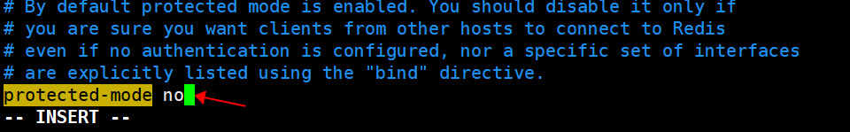

## 1.官网下载

### 1.1下载地址

redis官网：https://redis.io/download/

### 1.2自行选择版本下载

## 2.准备工作：下载安装最新版的gcc编译器

### 2.1安装

安装过程中会暂停让你确认，输入y再回车就行

1. ~~~
   yum install centos-release-scl scl-utils-build
   ~~~

2. ~~~
   yum install -y devtoolset-8-toolchain
   ~~~

3. ~~~
   scl enable devtoolset-8 bash
   ~~~

### 2.2测试gcc版本

~~~
gcc --version
~~~

若安装正确，会出现类似下图

## 3.开始安装

### 3.1将文件拷到Linux机器上

将 redis-6.2.6.tar.gz 放到 /usr/local/software

### 3.2安装步骤

1. 进入software文件夹

   ~~~
   cd /usr/local/software
   ~~~

2. 进行解压

   ~~~
   tar -zxvf redis-6.2.6.tar.gz
   ~~~

3. 进入解压后的目录

   ~~~
   cd redis-6.2.6/
   ~~~

4. 在redis-6.2.6目录下执行make命令进行编译

   ~~~
   make
   ~~~

5. 不用进行make test，直接安装

   ~~~
   make install
   ~~~

6. 安装完成，安装目录为：/usr/local/bin

   

### 3.3目录解释

- redis-benchmark:性能测试工具，可以在自己本子运行，看看自己本子性能如何
- redis-check-aof：修复有问题的AOF文件，rdb和aof后面讲
- redis-check-dump：修复有问题的dump.rdb文件
- redis-sentinel：Redis集群使用
- redis-server：Redis服务器启动命令
- redis-cli：客户端，操作入口

## 4.设置后台启动

### 4.1备份redis.conf

拷贝一份/usr/local/software/redis-6.2.6/redis.conf到其他目录

### 4.2后台启动设置daemonize no改成yes

修改redis.conf(257行，可能会不同)文件将里面的daemonize no 改成 yes，让服务在后台启动

1. 进入文件夹

   ~~~
   cd /usr/local/software
   ~~~

2. 修改redis.conf

   ~~~
   vim redis.conf
   ~~~

   

   

## 5.设置redis永久密码

修改redis.conf(901行，可能会不同)文件将里面的\# requirepass foobared改成 requirepass xxxxx(密码)

1. 进入文件夹

   ~~~
   cd /usr/local/software
   ~~~

2. 修改redis.conf

   ~~~
   vim redis.conf
   ~~~

   

## 6.开启redis远程访问服务

1. 进入文件夹

   ~~~
   cd /usr/local/software
   ~~~

2. 修改redis.conf

   ~~~
   vim redis.conf
   ~~~

### 6.1关闭bind

注释这一行

### 6.2本机访问保护模式设置no

将原来的yes改为no

## 7.后台启动redis

  ### 7.1 启动

~~~
cd /usr/local/bin
redis-server /usr/local/software/redis.conf
~~~

### 7.2查看redis进程

~~~
ps -ef|grep redis
~~~

如果刚刚配置过远程访问服务，可以看到redis-server进程端口号前会多个星号

### 7.3使用客户端访问

1. 客户端访问

   ~~~
   redis-cli
   ~~~

2. 测试连通

   ~~~
   ping
   ~~~

3. 若设置了密码，需要在redis-cli后输入密码

   ~~~
   auth 123456(你的密码)
   ~~~

   

## 8.关闭redis

1. 查看进程号

   ~~~
   ps -ef|grep redis
   ~~~

2. 关闭进程

   ~~~
   kill -9 28652（进程号）
   ~~~

   

